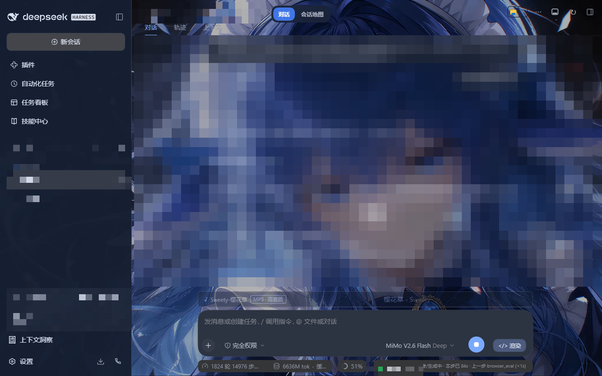

# dsh-page-refresh · 为 DeepSeek Harness 官方桌面版设计的会话头刷新按钮

给 [DeepSeek Harness](https://github.com/deepseek-ai/dsh)（下称 DSH）的 **Web 界面**加一个 `↻` 刷新按钮，点一下页面就地重载，不用去浏览器菜单/快捷键里找。

> **面向桌面版（Electron 壳）设计**：桌面版里 `F5` 常被网页浏览区域吃掉或与应用快捷键冲突，页面卡住时想刷新只能绕路。这个按钮把刷新放回会话头右上角，一次点击直达。Web 网页版同样可用。



## 特性

- **位置固定**：会话头右侧工具区（`utilities` 槽位）最右，`order: 999`
- **零 token**：纯客户端插件，不注册任何 model tool，每轮对话成本为 0
- **零依赖**：不启引擎、不碰后端、不写状态文件
- **样式随主题**：继承当前主题文字色，悬停高亮，26×26 圆角按钮

## 安装

```powershell
# 从仓库根目录执行（插件在 plugins/dsh-page-refresh/）
npx @deepseek-ai/dsh plugin --profile web add "<本仓库路径>\plugins\dsh-page-refresh"
```

> **桌面版注意**：桌面版宿主运行的是 `desktop` profile，而 `plugin add` CLI 拒绝管理它（"managed exclusively by the Electron application"）。此时需手动登记三处，缺一不可：
>
> 1. `~\.dsh\profiles\desktop\package.json` → `dependencies` 加 `"dsh-page-refresh": "link:<插件路径>"`
> 2. 同文件 `dsh.profile.bundles` 数组加 `"dsh-page-refresh"`
> 3. 在 `~\.dsh\profiles\desktop\` 下执行 `pnpm install`（落 symlink）
>
> 全部完成后**重启 DSH** 生效。

## 卸载

```powershell
npx @deepseek-ai/dsh plugin --profile web remove dsh-page-refresh
# 桌面版手动装的：把上面三处登记原样撤掉，再重启
```

## 改造

`plugins/dsh-page-refresh/client.js` 里：

- **换位置**：调 `order: 999`（越小越靠左）
- **换图标**：改组件返回的 `'\u21BB'`（↻）
- **换行为**：改 `window.location.reload()`

改代码**不需要重启 DSH**，保存后刷新页面即生效（宿主按文件内容哈希发版）。

## 文件结构

```
plugins/dsh-page-refresh/
├── package.json        # dsh.bundle.patch + dsh.client 声明
├── cordis.patch.yml    # bundle patch：插入插件行
├── screenshots.json    # 插件市场截图声明
├── assets/             # 截图
├── lib/index.js        # host 半边（空实现，只为满足 bundle 契约）
└── client.js           # 客户端半边：注册 utilities 槽位按钮
```

## 已验证环境

- DSH `0.2.0-rc.2`（**官方桌面版**；本机验证环境为官方源码编译构建）
- Windows 11 + Edge/Chromium 内核
- 需要 `package.json` 带 `"type": "module"`（宿主按 ESM 解析 host 半边，缺了会静默跳过整个 bundle）

## License

MIT
