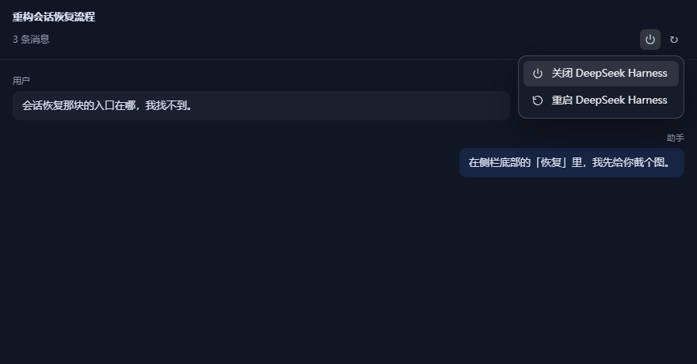

# dsh-page-refresh · 为 DeepSeek Harness 官方桌面版设计的会话头工具按钮

给 [DeepSeek Harness](https://github.com/deepseek-ai/dsh)（下称 DSH）的 **Web 界面**加两个会话头按钮：一个刷新按钮、一个电源菜单（重启 / 关闭 DSH）。

> **面向桌面版（Electron 壳）设计**：桌面版里 `F5` 常被网页浏览区域吃掉或与应用快捷键冲突，页面卡住时想刷新只能绕路；想退出应用又得去右下角托盘翻菜单。这两个按钮把它们放回会话头右上角，一次点击直达。Web 网页版同样可用（电源按钮在网页版下没有意义，见下文平台限制）。

变更历史见 [CHANGELOG.md](CHANGELOG.md)。



## 特性

- **刷新按钮**：一点即重载页面，等价 F5，不丢会话数据。图标是与电源同规格的 24 网格内联 SVG，不用 `↻` 字形 —— 那个字形会落到 `SimSun, serif` 之类的字体上，换主题字体就偏，两个按钮看起来不同源
- **电源菜单**：点电源图标拉出两个选项 —— **重启 DeepSeek Harness** / **关闭 DeepSeek Harness**
- **位置固定**：会话头右侧工具区（`utilities` 槽位），电源在左、刷新在右（`order: 998` / `999`）
- **零 token**：不注册任何 model tool，每轮对话成本为 0
- **零依赖**：不启引擎、不写状态文件；host 半边只在收到点击时才动
- **样式随主题**：菜单为半透明毛玻璃，继承当前主题文字色

## 电源菜单怎么工作的

写这个功能的两个硬约束：**关掉之后不能被看门狗拉回来**，以及**重启要保留原来的启动参数**。

**关闭**：先尽力往 DSH 的 update-journal 追加一条 `{"event":"quit-requested"}`（这是应用自身托盘「退出」走的同一机制，装了看门狗就会认得它），再杀进程。

> **杀的是自己这一棵进程树，不是所有同名进程**：宿主由桌面壳以 `ELECTRON_RUN_AS_NODE=1` 拉起，此时 `process.ppid` 就是 Electron 主进程，于是走 `taskkill /PID <ppid> /T /F`。同时开着第二个实例（另一个 profile，或 desktop 与 web 各一份）时，另一个实例不会被牵连。没有这个环境变量时（例如有人在终端里直接跑 CLI），退回按镜像名杀。

> **按树杀之前先核一次名**：花约 270ms 用 `tasklist /FI "PID eq <ppid>" /NH /FO CSV` 读父进程的镜像名，确认它确实是 `DeepSeek Harness.exe` 才按树杀；名不符或读不到就退回按名杀。防的是「手工 `set ELECTRON_RUN_AS_NODE=1` 后在终端里跑 host」这一种情形 —— 那种情况下 `ppid` 是那个终端，按树杀会把它一起带走。日志里区分 `kill-mode=tree` 与 `kill-mode=image reason=…`，出问题一眼看得出走了哪条。

> **journal 是 opt-in 的**：DSH 主进程读 `DSH_DESKTOP_UPDATE_JOURNAL_DIR` 环境变量，没设时它根本不建 journal。插件在这种情况下**记录失败不拦着关闭** —— 因为没有 journal 的机器同样不会有读它的看门狗，直接杀就行。journal 目录按 `DSH_DESKTOP_UPDATE_JOURNAL_DIR` → `~/.dsh/logs/update-journal` 两级定位。

**重启**：分两条路，优先本机定制、否则通用。

- 若 `~/.dsh/freeze-restart-hidden.vbs` 存在（定制重启链），走它，并传 `fast` 跳过链内的等待
- 否则调用本插件自带的 `lib/dsh-power.ps1`：**读完当前主进程的完整命令行再杀，然后用同样的 exe、参数、工作目录重拉**，所以 `--user-data-dir` 之类的启动参数不会丢

> 主进程的判据是**父进程不在同名的这批进程里**（Electron 入口进程的特征）。只用「命令行不含 `--type=`」筛选是不够的 —— 实测在一台机器上会剩下 3 个候选（`crashpad_handler` 等旁支也没有 `--type=`），有可能抓错进程、用错的 exe 路径去重拉。

**点下去的瞬间界面就消失**：渲染进程拿不到 Electron 的 `app` 对象（contextIsolation），调不了 `app.quit()`；DSH 的 26 个 `DESKTOP_IPC` 通道里也没有退出通道（已翻过 `app.asar` 确认）。所以走的是「**点击的同一个 tick 里全屏盖黑 + 后台杀进程**」——感知上是零延迟，进程其实在约 200 毫秒后死。

## 平台限制

**电源菜单目前是 Windows 专用。**

- 关闭用 `taskkill`、通用重启用 PowerShell + WMI 读进程信息 —— 都是 Windows 命令
- 在 macOS / Linux 上，两个写端点直接回 `501`（`{"ok":false,"error":"power API is Windows-only","platform":…}`），不会让客户端进入 90 秒兜底等待；客户端挂载时还会探一次 `/api/power/status`，非 Windows 就把电源按钮置灰并注明原因 —— 用户根本点不到
- 刷新按钮不受影响

**验证范围**：本插件在一台 Windows 11 机器上实测通过（刷新、拉起菜单、两条重启路径、关闭）。**通用重启路径（`dsh-power.ps1`）已端到端真跑过** —— 临时把定制链的 vbs 藏起来逼它走 portable，实测 `killed count=4` → 剥离环境变量 → 按原命令行重拉 → `verify-ok`。**按 PID 杀树也已真机验过** —— 起第二个实例（另一 profile）当对照，对主实例点关闭，主树 6 个进程全灭、对照实例全活，日志里留下 `kill-mode=tree` 与核验耗时。另有 26 条单测覆盖分支选择、父进程核验的三条路径、平台 501 与日志轮转。尚未验证的只剩市场截图渲染，以及非 Windows 真机（没有设备）。如果你在别的机器上遇到问题，请带 `~/.dsh/logs/` 里的相关输出提 issue。

## 测试

仓库自带三个验收脚本，都不产生真实进程（`spawn` / `execFile` 被假模块整体替换）、也不碰真实 journal（改道到系统临时目录），任何机器上都能安全跑：

```powershell
cd plugins/dsh-page-refresh
npm test          # 等价于 node tests/run-all.mjs
```

- `tests/verify-treekill.mjs` —— 26 条断言：关闭路径的两种分支、父进程核验的三条路径、`restart` 的 portable 兜底分支、四种日志留痕，以及 5MB 日志轮转
- `tests/verify-501.mjs` —— 伪造非 Windows 平台，断言两个写端点回 501、只读端点仍 200
- `tests/verify-quotearg.cjs` —— 从 `lib/index.js` 里**抽出真实的 `quoteArg` 实现**再跑 A/B 用例；不抄实现，所以将来改了实现测试就会红

## 安装

**npm（已发布 [`dsh-page-refresh`](https://www.npmjs.com/package/dsh-page-refresh)）：**

```powershell
npx @deepseek-ai/dsh plugin --profile web add dsh-page-refresh
```

**或从源码（本仓库插件在 `plugins/dsh-page-refresh/`）：**

```powershell
npx @deepseek-ai/dsh plugin --profile web add "<本仓库路径>\plugins\dsh-page-refresh"
```

> **桌面版注意**：桌面版宿主运行的是 `desktop` profile，而 `plugin add` CLI 拒绝管理它（"managed exclusively by the Electron application"）。此时需手动登记三处，缺一不可：
>
> 1. `~\.dsh\profiles\desktop\package.json` → `dependencies` 加 `"dsh-page-refresh": "link:<插件路径>"`
> 2. 同文件 `dsh.profile.bundles` 数组加 `"dsh-page-refresh"`
> 3. 在 `~\.dsh\profiles\desktop\` 下执行 `pnpm install`（落 symlink）
>
> 全部完成后**重启 DSH** 生效。

## 卸载

```powershell
npx @deepseek-ai/dsh plugin --profile web remove dsh-page-refresh
# 桌面版手动装的：把上面三处登记原样撤掉，再重启
```

## 改造

`plugins/dsh-page-refresh/client.js` 里：

- **换位置**：调 `order`（越小越靠左）
- **换图标**：`IconPower` / `IconRestart` 是内联 SVG，改 `d` 属性即可
- **换行为**：改 `fire()` 里的 `fetch('/api/power/…')`

改客户端代码**不需要重启 DSH**，保存后刷新页面即生效（宿主按文件内容哈希发版）。
改 `lib/` 下的 host 半边（含 `dsh-power.ps1`）**需要重启 DSH**。

## 文件结构

```
plugins/dsh-page-refresh/
├── package.json        # dsh.bundle.patch + dsh.client 声明
├── cordis.patch.yml    # bundle patch：插入插件行
├── screenshots.json    # 插件市场截图声明
├── assets/             # 截图
├── lib/
│   ├── index.js        # host 半边：/api/power/{status,restart,close} 三条本地路由
│   └── dsh-power.ps1   # 通用重启/关闭脚本（读原命令行后重拉）
└── client.js           # 客户端半边：注册 utilities 槽位两个按钮
```

> `lib/*.ps1` 必须是**纯 ASCII**：Windows PowerShell 把无 BOM 的 `.ps1` 当 ANSI 读，非 ASCII 注释会破坏解析。

## 已验证环境

- DSH `0.2.1-rc.2`（**官方桌面版**）
- Windows 11 + Edge/Chromium 内核
- 需要 `package.json` 带 `"type": "module"`（宿主按 ESM 解析 host 半边，缺了会静默跳过整个 bundle）

## License

MIT